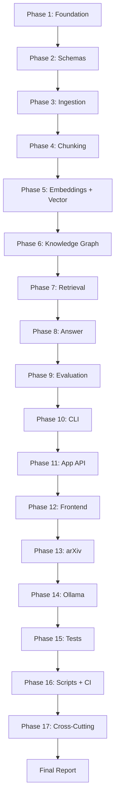

# AutoRAG Full Repository Code Review Plan

**Date:** 2026-02-14  
**Scope:** Complete in-depth code review of the `autokg_rag` repository  
**Repo:** `/Users/dustinober/Projects/AutoRAG`

---

## 1. Review Objectives

- Identify bugs, logic errors, and edge-case vulnerabilities
- Evaluate code quality, readability, and maintainability
- Assess adherence to project conventions (ruff, mypy strict, Pydantic v2)
- Verify test coverage and test quality
- Review security concerns (file I/O, user input, LLM prompt injection)
- Check architecture consistency and separation of concerns
- Flag dead code, TODOs, and incomplete implementations
- Validate documentation accuracy against actual behavior

---

## 2. Repository Overview

```
autokg_rag/              # Core library (src/autokg_rag/)
├── answer/              # LLM answer composition + grounding
├── app_api/             # Service layer for Streamlit frontend
├── arxiv/               # arXiv paper search & ingestion
├── chunking/            # Text chunking strategies
├── config/              # YAML config loading + settings
├── embeddings/          # Embedding providers (fastembed, ollama)
├── eval/                # Evaluation: dataset builder, matrix runner, metrics
├── ingest/              # PDF parsing, section detection, TOC, tables, images
├── io/                  # Artifact I/O helpers
├── kg/                  # Knowledge graph: ontology extraction, SQLite store
├── observability/       # Logging + metrics
├── ollama/              # Ollama client wrapper
├── retrieval/           # Vector, graph, hybrid retrieval + reranking
├── schemas/             # Pydantic models (API, records, provenance)
├── vector/              # Vector index + image index
├── cli.py               # Typer CLI entrypoint
└── exceptions.py        # Custom exceptions

app/                     # Streamlit frontend
├── streamlit_app.py     # Main app (~20KB)
├── components/          # UI components
└── styles/              # CSS

tests/                   # 50+ test files across 15 directories
configs/                 # YAML configuration files
scripts/                 # Shell scripts for milestone pipelines
```

### Tech Stack
- **Python 3.11+**, setuptools build
- **Pydantic v2**, Typer CLI, PyYAML
- **DuckDB**, SQLite, NetworkX for data/graph
- **FastEmbed** + optional **Ollama** for embeddings
- **Streamlit** frontend
- **Ruff** linter (`E, F, I, B, UP, N, W`), **mypy** strict mode
- **pytest** test framework

---

## 3. Review Phases

### Phase 1 — Foundation & Configuration

Review the project scaffolding, configuration system, and shared utilities.

| # | File / Module | Focus Areas |
|---|---------------|-------------|
| 1.1 | `pyproject.toml`, `Makefile`, `ruff.toml`, `mypy.ini`, `pytest.ini` | Dependency pinning, build correctness, linter/type-checker config completeness |
| 1.2 | `src/autokg_rag/__init__.py`, `exceptions.py` | Package exports, exception hierarchy |
| 1.3 | `src/autokg_rag/config/settings.py` | Pydantic settings model, env-var binding, defaults |
| 1.4 | `src/autokg_rag/config/loaders.py` | YAML loading, config merging, path resolution |
| 1.5 | `src/autokg_rag/io/artifacts.py` | Artifact path construction, file I/O safety |
| 1.6 | `src/autokg_rag/observability/logging.py`, `metrics.py` | Logging setup, metric collection patterns |
| 1.7 | `configs/*.yaml` | Config schema consistency, valid references |

**Checklist:**
- [ ] Are all dependencies version-pinned appropriately?
- [ ] Does `mypy --strict` pass without ignores that hide real issues?
- [ ] Are config defaults safe and well-documented?
- [ ] Is YAML loading resilient to missing/malformed files?
- [ ] Are artifact paths constructed safely (no path traversal)?

---

### Phase 2 — Schemas & Data Contracts

Review the Pydantic models that define the data contracts across the pipeline.

| # | File | Focus Areas |
|---|------|-------------|
| 2.1 | `src/autokg_rag/schemas/records.py` | ChunkRecord, AnswerRecord field completeness, validators |
| 2.2 | `src/autokg_rag/schemas/provenance.py` | Provenance model integrity, required fields |
| 2.3 | `src/autokg_rag/schemas/api.py` | API payload contracts, serialization |
| 2.4 | `src/autokg_rag/schemas/__init__.py` | Re-exports, public API surface |

**Checklist:**
- [ ] Do all models enforce the `doc_id/page/section/chunk_id` provenance contract?
- [ ] Are field types strict enough (e.g., `str` vs `Path`, optional vs required)?
- [ ] Are validators present for business rules?
- [ ] Is serialization/deserialization consistent with artifact file formats?

---

### Phase 3 — Ingestion Pipeline

Review PDF parsing, section detection, and artifact generation.

| # | File | Focus Areas |
|---|------|-------------|
| 3.1 | `src/autokg_rag/ingest/pdf_parse.py` | PDF parsing robustness, error handling |
| 3.2 | `src/autokg_rag/ingest/sectionize.py` | Section boundary detection logic |
| 3.3 | `src/autokg_rag/ingest/pmbok_toc_parser.py` | TOC parsing, edge cases |
| 3.4 | `src/autokg_rag/ingest/header_footer_filter.py` | Header/footer removal accuracy |
| 3.5 | `src/autokg_rag/ingest/table_extractor.py` | Table extraction correctness |
| 3.6 | `src/autokg_rag/ingest/image_extract.py`, `image_caption.py` | Image pipeline, model loading |
| 3.7 | `src/autokg_rag/ingest/manifest.py` | Manifest generation, SHA256 integrity |
| 3.8 | `src/autokg_rag/ingest/pipeline.py` | Pipeline orchestration, error recovery |

**Checklist:**
- [ ] Does PDF parsing handle corrupted/encrypted PDFs gracefully?
- [ ] Are section boundaries accurate for non-PMBOK documents?
- [ ] Is the manifest SHA256 computed correctly and consistently?
- [ ] Does the pipeline handle empty pages, scanned PDFs, mixed content?
- [ ] Are temporary files cleaned up properly?
- [ ] Is the image captioning pipeline gated behind the `vision` extra?

---

### Phase 4 — Chunking Strategies

Review all chunking implementations for correctness and consistency.

| # | File | Focus Areas |
|---|------|-------------|
| 4.1 | `src/autokg_rag/chunking/base.py` | Base class contract, chunk metadata preservation |
| 4.2 | `src/autokg_rag/chunking/fixed.py` | Fixed-window chunking, overlap handling |
| 4.3 | `src/autokg_rag/chunking/heading_recursive.py` | Heading-based splitting, recursion depth |
| 4.4 | `src/autokg_rag/chunking/sentence_window.py` | Sentence window boundaries |
| 4.5 | `src/autokg_rag/chunking/semantic_breakpoint.py` | Semantic breakpoint detection |

**Checklist:**
- [ ] Do all strategies preserve provenance fields through chunking?
- [ ] Are chunk_id values unique and deterministic?
- [ ] Do overlap/window parameters behave correctly at document boundaries?
- [ ] Is empty input handled gracefully?

---

### Phase 5 — Embeddings & Vector Index

Review embedding generation and vector storage/retrieval.

| # | File | Focus Areas |
|---|------|-------------|
| 5.1 | `src/autokg_rag/embeddings/base.py` | Provider interface contract |
| 5.2 | `src/autokg_rag/embeddings/factory.py` | Provider selection logic |
| 5.3 | `src/autokg_rag/embeddings/fastembed_provider.py` | FastEmbed integration |
| 5.4 | `src/autokg_rag/embeddings/ollama_provider.py` | Ollama embedding, error handling, retries |
| 5.5 | `src/autokg_rag/embeddings/pipeline.py` | Embedding pipeline orchestration |
| 5.6 | `src/autokg_rag/vector/index.py` | Vector index build + search |
| 5.7 | `src/autokg_rag/vector/image_index.py` | Image vector index |

**Checklist:**
- [ ] Is the embedding provider interface well-defined and consistently implemented?
- [ ] Are embedding dimensions validated against the index?
- [ ] Does the Ollama provider handle connection failures gracefully?
- [ ] Is batch embedding efficient and memory-safe?
- [ ] Are vector similarity scores normalized consistently?

---

### Phase 6 — Knowledge Graph

Review ontology extraction, graph storage, and graph-based retrieval.

| # | File | Focus Areas |
|---|------|-------------|
| 6.1 | `src/autokg_rag/kg/ontology_extract.py` | Entity/relation extraction logic |
| 6.2 | `src/autokg_rag/kg/canonicalize.py` | Entity canonicalization |
| 6.3 | `src/autokg_rag/kg/store_sqlite.py` | SQLite schema, CRUD operations, SQL injection |
| 6.4 | `src/autokg_rag/kg/pipeline.py` | KG build pipeline orchestration |
| 6.5 | `src/autokg_rag/kg/retriever.py` | Graph traversal retrieval |

**Checklist:**
- [ ] Is ontology extraction deterministic and reproducible?
- [ ] Are SQL queries parameterized (no injection risk)?
- [ ] Does canonicalization handle Unicode, casing, and aliases?
- [ ] Is graph traversal bounded to prevent runaway queries?
- [ ] Are KG artifacts consistent with the schema in `docs/schemas.md`?

---

### Phase 7 — Retrieval & Reranking

Review vector, graph, and hybrid retrieval plus reranking.

| # | File | Focus Areas |
|---|------|-------------|
| 7.1 | `src/autokg_rag/retrieval/hybrid.py` | Hybrid score fusion logic |
| 7.2 | `src/autokg_rag/retrieval/fusion.py` | Reciprocal rank fusion implementation |
| 7.3 | `src/autokg_rag/retrieval/rerank.py` | Reranker interface |
| 7.4 | `src/autokg_rag/retrieval/ollama_reranker.py` | Ollama-based reranking |

**Checklist:**
- [ ] Is score normalization correct across vector and graph sources?
- [ ] Does hybrid retrieval handle cases where one source returns zero results?
- [ ] Is the reranker optional and gracefully disabled when not configured?
- [ ] Are top-k semantics consistent across all retrieval modes?

---

### Phase 8 — Answer Composition & Grounding

Review the LLM answer generation and citation grounding.

| # | File | Focus Areas |
|---|------|-------------|
| 8.1 | `src/autokg_rag/answer/composer.py` | Answer composition logic, prompt construction |
| 8.2 | `src/autokg_rag/answer/grounding.py` | Citation grounding and support scoring |
| 8.3 | `src/autokg_rag/answer/llm_adapter.py` | LLM adapter interface |
| 8.4 | `src/autokg_rag/answer/ollama_adapter.py` | Ollama LLM integration |

**Checklist:**
- [ ] Are prompts well-structured and injection-resistant?
- [ ] Does the composer respect `answer_max_sentences` configuration?
- [ ] Is citation extraction robust to varied LLM output formats?
- [ ] Are LLM errors (timeout, malformed response) handled gracefully?
- [ ] Is the grounding score computation correct?

---

### Phase 9 — Evaluation Framework

Review the eval pipeline: dataset generation, matrix runner, metrics, and reporting.

| # | File | Focus Areas |
|---|------|-------------|
| 9.1 | `src/autokg_rag/eval/dataset_builder.py` | Question generation logic (~22KB, largest eval file) |
| 9.2 | `src/autokg_rag/eval/matrix_runner.py` | Experiment matrix execution (~24KB, largest file) |
| 9.3 | `src/autokg_rag/eval/metrics.py` | Metric computation correctness |
| 9.4 | `src/autokg_rag/eval/judge.py` | LLM judge evaluation |
| 9.5 | `src/autokg_rag/eval/ab_test.py` | A/B test comparison logic |
| 9.6 | `src/autokg_rag/eval/report.py` | Report generation |

**Checklist:**
- [ ] Are evaluation metrics computed correctly (precision, recall, F1, MRR)?
- [ ] Does the matrix runner handle experiment failures gracefully?
- [ ] Is the dataset builder deterministic with a fixed seed?
- [ ] Does the judge evaluate faithfully without positional bias?
- [ ] Are eval artifacts written atomically to prevent partial results?

---

### Phase 10 — CLI

Review the Typer CLI entrypoint.

| # | File | Focus Areas |
|---|------|-------------|
| 10.1 | `src/autokg_rag/cli.py` | Command definitions (~31KB, largest source file), argument validation, error handling |

**Checklist:**
- [ ] Are all CLI commands well-documented with help text?
- [ ] Is argument validation sufficient (paths exist, valid modes, etc.)?
- [ ] Are errors surfaced with clear messages and non-zero exit codes?
- [ ] Is the CLI consistent with the Makefile targets?

---

### Phase 11 — App API & Services

Review the service layer that bridges the CLI/library with the Streamlit frontend.

| # | File | Focus Areas |
|---|------|-------------|
| 11.1 | `src/autokg_rag/app_api/service.py` | Core service orchestration |
| 11.2 | `src/autokg_rag/app_api/endpoints.py` | API endpoint definitions |
| 11.3 | `src/autokg_rag/app_api/document_service.py` | Document CRUD operations |
| 11.4 | `src/autokg_rag/app_api/store_service.py` | Store management |
| 11.5 | `src/autokg_rag/app_api/upload_service.py` | File upload handling |
| 11.6 | `src/autokg_rag/app_api/ollama_model_service.py` | Ollama model discovery |
| 11.7 | `src/autokg_rag/app_api/doctor.py` | System health diagnostics (~27KB) |
| 11.8 | `src/autokg_rag/app_api/retention.py` | Artifact retention policy |

**Checklist:**
- [ ] Is the service layer properly decoupled from the UI?
- [ ] Are file uploads validated (type, size, path safety)?
- [ ] Does store CRUD handle concurrent access safely?
- [ ] Is the doctor diagnostic comprehensive and accurate?
- [ ] Is artifact retention correctly enforced?

---

### Phase 12 — Streamlit Frontend

Review the UI application and components.

| # | File | Focus Areas |
|---|------|-------------|
| 12.1 | `app/streamlit_app.py` | Main app logic (~20KB), state management |
| 12.2 | `app/components/sidebar.py` | Sidebar navigation |
| 12.3 | `app/components/document_manager.py` | Document management UI |
| 12.4 | `app/components/store_manager.py` | Store management UI |
| 12.5 | `app/components/model_selector.py` | Model selection |
| 12.6 | `app/components/question_bar.py` | Question input |
| 12.7 | `app/components/answer_card.py` | Answer display |
| 12.8 | `app/components/citation_tabs.py` | Citation display |
| 12.9 | `app/components/arxiv_panel.py` | arXiv integration |
| 12.10 | `app/components/upload_panel.py` | Upload UI |
| 12.11 | `app/components/empty_state.py` | Empty state handling |
| 12.12 | `app/styles/*.css` | CSS review |

**Checklist:**
- [ ] Is Streamlit session state managed correctly (no stale state bugs)?
- [ ] Are user inputs sanitized before passing to backend?
- [ ] Is error handling user-friendly (not raw tracebacks)?
- [ ] Are components properly decomposed and reusable?
- [ ] Is the CSS clean and consistent?

---

### Phase 13 — arXiv Integration

Review the arXiv client and ingestion pipeline.

| # | File | Focus Areas |
|---|------|-------------|
| 13.1 | `src/autokg_rag/arxiv/client.py` | arXiv API usage, error handling |
| 13.2 | `src/autokg_rag/arxiv/ingest.py` | arXiv PDF ingestion |

**Checklist:**
- [ ] Is the arXiv API used within rate limits?
- [ ] Are downloaded PDFs validated before ingestion?
- [ ] Is network failure handled gracefully?

---

### Phase 14 — Ollama Integration

Review the Ollama client and optional integration points.

| # | File | Focus Areas |
|---|------|-------------|
| 14.1 | `src/autokg_rag/ollama/client.py` | Ollama HTTP client, connection handling |

**Checklist:**
- [ ] Is the Ollama integration truly optional (graceful degradation)?
- [ ] Are timeouts and retries configured properly?
- [ ] Is the client thread-safe for concurrent requests?

---

### Phase 15 — Test Suite Review

Review test quality, coverage, and correctness.

| # | Test Directory | Focus Areas |
|---|----------------|-------------|
| 15.1 | `tests/e2e/` | E2E tests for milestones M1–M8 |
| 15.2 | `tests/answer/` | Answer composition tests |
| 15.3 | `tests/app/` | App API and Streamlit tests |
| 15.4 | `tests/chunking/` | Chunking strategy tests |
| 15.5 | `tests/config/` | Configuration tests |
| 15.6 | `tests/contracts/` | Schema contract tests |
| 15.7 | `tests/embeddings/` | Embedding provider tests |
| 15.8 | `tests/eval/` | Evaluation framework tests |
| 15.9 | `tests/ingest/` | Ingestion pipeline tests |
| 15.10 | `tests/kg/` | Knowledge graph tests |
| 15.11 | `tests/observability/` | Logging/metrics tests |
| 15.12 | `tests/ollama/` | Ollama client tests |
| 15.13 | `tests/retrieval/` | Retrieval tests |
| 15.14 | `tests/vector/` | Vector index tests |
| 15.15 | `test_pmbok_ingestion.py` | Root-level test (should it be in tests/?) |

**Checklist:**
- [ ] Are tests isolated (no cross-test state leakage)?
- [ ] Do tests use fixtures and mocks appropriately?
- [ ] Are edge cases covered (empty input, malformed data, network failure)?
- [ ] Is test coverage adequate for critical paths?
- [ ] Are E2E tests reliable (no flaky tests)?
- [ ] Is `test_pmbok_ingestion.py` orphaned at the root?

---

### Phase 16 — Scripts & CI

Review shell scripts and CI configuration.

| # | File | Focus Areas |
|---|------|-------------|
| 16.1 | `scripts/*.sh` | Script correctness, error handling, `set -e` usage |
| 16.2 | `.github/` | CI workflow configuration |

**Checklist:**
- [ ] Do all scripts use `set -euo pipefail`?
- [ ] Are scripts idempotent (safe to re-run)?
- [ ] Does CI run lint, typecheck, and tests?
- [ ] Are CI artifacts cached appropriately?

---

### Phase 17 — Cross-Cutting Concerns

Final pass reviewing concerns that span multiple modules.

| # | Concern | Focus Areas |
|---|---------|-------------|
| 17.1 | **Error handling** | Consistent exception patterns across modules |
| 17.2 | **Logging** | Structured logging, appropriate log levels |
| 17.3 | **Security** | Path traversal, prompt injection, file validation |
| 17.4 | **Performance** | Large file handling, memory usage, batch processing |
| 17.5 | **Documentation** | Accuracy of `docs/`, `README.md`, docstrings |
| 17.6 | **Dead code** | Unused imports, unreachable code, stale modules |
| 17.7 | **Dependency hygiene** | Unused dependencies, version conflicts |
| 17.8 | **Code duplication** | Repeated patterns that should be extracted |

---

## 4. Review Process



### Per-Phase Process

1. **Read** every file in the module using `read_file`
2. **Analyze** against the phase checklist
3. **Document** findings with severity levels:
   - 🔴 **Critical** — Bugs, security issues, data corruption risk
   - 🟠 **Major** — Logic errors, missing error handling, broken contracts
   - 🟡 **Minor** — Style issues, inconsistencies, missing docs
   - 🔵 **Suggestion** — Improvements, refactoring opportunities
4. **File issues** referencing specific lines and files
5. **Update** the review tracking checklist

---

## 5. Deliverables

| Deliverable | Location |
|-------------|----------|
| Phase-by-phase findings | `plans/code-review-findings/phase-NN-*.md` |
| Summary report | `plans/code-review-findings/summary.md` |
| Issue list with severity | `plans/code-review-findings/issues.md` |
| Recommended action items | `plans/code-review-findings/action-items.md` |

---

## 6. File Inventory

Total source files to review: **~70 Python files** across 15 modules, plus:
- 12 Streamlit frontend files
- 7 YAML config files
- 8 shell scripts
- 50+ test files
- CI/CD configuration
- Documentation files

---

## 7. Execution Mode

This review should be executed in **Code Reviewer** mode (`code-reviewer`), processing one phase at a time. Each phase produces a findings document before moving to the next.
