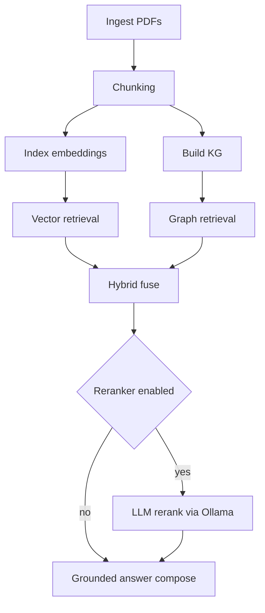

# Plan: Integrate Ollama into AutoRAG (embeddings + LLM reranking)

## Goal

Add an **optional** Ollama-backed path to this repo so we can:

1. Generate vector embeddings using **`embeddinggemma:300m`** (Ollama model)
2. Use **`llama3:8b`** as a **retrieval-time LLM reranker** (and optionally for answer rewriting later)

The existing deterministic baseline must remain available (today it uses a hash embedder).

## Current architecture (what we are changing)

Key facts from the current code:

- Vector indexing always uses a deterministic local embedder: `LocalHashEmbeddingProvider`.
- The embedding model name is currently treated as a label and stored, but does not change embedding behavior.
- Query-time answer composition is extractive by default; a sentence adapter interface exists for optional LLM rewriting.

### Where embeddings happen today

- Indexing calls `build_embedding_artifacts(...)`, which instantiates the local hash embedder and writes `embeddings.npy` + `embedding_meta.parquet`.
- Querying uses the same local hash embedder to embed the question and performs cosine similarity search.

### Where retrieval happens today

- Vector retrieval: similarity search over `embeddings.npy`.
- Graph retrieval: traversal over `kg.sqlite`.
- Hybrid retrieval: fusion of vector + graph.

### Where we can plug in an LLM

- Retrieval-time reranking: after we have candidate chunks/hits, reorder them using `llama3:8b`.
- Answer rewriting: use the existing `SentenceAdapter` interface to rewrite grounded sentences (optional, not required for “retriever”).

## Definitions (to avoid ambiguity)

- **Retriever** (in this plan): the component that produces an ordered list of chunk hits for a query.
  - We will keep the existing retrievers (vector/graph/hybrid) and add an **LLM reranking step**.
- **Reranker**: LLM that reorders candidate hits based on relevance to the question.

If you literally mean “replace retrieval with llama3 only” (no vector/graph search), that is a different design. This plan assumes **reranking on top of existing retrieval**.

## Non-goals

- Do not remove or weaken the deterministic “no external model” baseline.
- Do not require Ollama for CI to pass (unit tests should mock HTTP; optional integration tests can be skipped).
- Do not introduce a new vector DB; keep current `.npy` embedding artifacts.

## Prerequisites (developer machine)

1. Install and run Ollama.
   - Ensure Ollama is reachable at `http://localhost:11434` (default).
2. Pull models:
   - `ollama pull embeddinggemma:300m`
   - `ollama pull llama3:8b`
3. Verify embeddings endpoint works using curl (example; adapt to the exact endpoint your Ollama version supports):
   - `curl http://localhost:11434/api/embeddings -d '{"model":"embeddinggemma:300m","prompt":"hello"}'`
4. Verify generation endpoint works:
   - `curl http://localhost:11434/api/generate -d '{"model":"llama3:8b","prompt":"Say hello","stream":false}'`

## Design: configuration and provider selection

### New settings (configurable via YAML + env)

Add fields to the typed settings model so we can switch providers without changing code:

- `embedding_provider`: `local_hash` (default) | `ollama`
- `embedding_model`: string, default remains existing baseline label (but for Ollama should be `embeddinggemma:300m`)
- `ollama_base_url`: default `http://localhost:11434`
- `reranker_enabled`: bool, default false
- `reranker_model`: string, default `llama3:8b`
- `reranker_candidate_k`: int, how many hits to retrieve before reranking (e.g., 30)

Environment variable mapping examples:

- `AUTORAG_OLLAMA_BASE_URL=http://localhost:11434`
- `AUTORAG_EMBEDDING_PROVIDER=ollama`
- `AUTORAG_EMBEDDING_MODEL=embeddinggemma:300m`
- `AUTORAG_RERANKER_ENABLED=1`
- `AUTORAG_RERANKER_MODEL=llama3:8b`
- `AUTORAG_RERANKER_CANDIDATE_K=30`

### Provider factory

Implement a small factory function:

- Input: settings + explicit model name where needed
- Output: an object implementing the existing `EmbeddingProvider` protocol

This keeps call sites simple and avoids sprinkling `if provider == ...` across pipelines.

## Design: Ollama embeddings

### New embedding provider module

Implement `OllamaEmbeddingProvider` that implements `EmbeddingProvider`.

Requirements:

- Uses HTTP to call Ollama embeddings endpoint.
- Supports **batch embedding** to reduce overhead.
- Returns `float32` numpy array with shape `(len(texts), dim)`.
- Determines `dim` from returned vector length and validates consistency.
- Includes timeouts + clear exceptions that map to `RetrievalError`/`AutoRAGError` patterns.

### Endpoint compatibility strategy

Ollama has had more than one embeddings route shape across versions.
Implementation should be tolerant:

- Preferred: one request with list input (if supported)
- Fallback: loop and call single prompt per request

Add a “doctor”/health check that verifies the chosen endpoint works.

### Artifact metadata

Update embedding metadata so the recorded `dim` matches the **real model output dimension**.

This matters because `embeddinggemma:300m` will not necessarily be the current default `256`.

## Design: llama3:8b reranker

### What reranking does

Reranker input:

- `question: str`
- `candidates: list[{chunk_id, chunk_text, doc_id, page, section, base_score}]`

Reranker output:

- Ordered list of `chunk_id`s (best → worst), optionally with relevance scores.

We then reorder the hit list accordingly, keeping provenance fields intact.

### Prompt + output format

Use a strict JSON output contract so parsing is robust.

Example requested output:

```json
{
  "ranked_chunk_ids": ["c_001", "c_014", "c_002"],
  "notes": "optional"
}
```

Hardening rules:

- If JSON parse fails: fall back to original hit order (do not crash query path by default).
- If model returns unknown chunk IDs: ignore them.
- If fewer IDs returned than candidates: append remaining candidates in original order.

### Where reranking runs

Run reranking in the service/query layer so it applies to all modes:

- vector mode: rerank vector hits
- graph mode: rerank graph hits
- hybrid mode: rerank fused hits (recommended), or rerank before fusion (more complex)

Persist rerank traces to artifact directory for debuggability.

Suggested new artifact files per run:

- `rerank_trace.jsonl` (question_id, model, candidate_k, prompt hash, output, parse status)
- `reranked_hits.jsonl` (final ordered hit rows)

## Execution plan (step-by-step for a junior engineer)

### Step 1 — Add settings knobs

1. Extend the typed `Settings` model with Ollama + reranker fields.
2. Update base YAML config with safe defaults (keep deterministic behavior).
3. Extend config loader to read env vars for these new fields.

Acceptance criteria:

- Existing commands run without needing Ollama.
- `Settings.model_validate(...)` still forbids unknown keys.

### Step 2 — Add an Ollama client helper

1. Add a small internal HTTP client wrapper (base URL, timeout, POST helper).
2. Add an error type or map HTTP errors to existing exception types.

Acceptance criteria:

- No call sites build URLs by hand.
- All Ollama errors are actionable (include endpoint + model name).

### Step 3 — Implement `OllamaEmbeddingProvider`

1. Implement `embed_texts(texts)`.
2. Validate output shape.
3. Set `dim` based on response.

Acceptance criteria:

- Can embed a list of strings.
- Returns `np.float32` matrix.

### Step 4 — Provider selection in indexing + query

1. Update vector index pipeline to choose the embedding provider by settings.
2. Update vector query pipeline to embed questions using the same model/provider recorded in metadata.

Acceptance criteria:

- Re-index required when switching embedding model/dim.
- Clear error when embedding artifacts and requested provider/model mismatch.

### Step 5 — Implement reranker

1. Implement `OllamaReranker` that calls Ollama generate endpoint with `stream=false`.
2. Build prompt with:
   - the question
   - a numbered list of candidates with short text
   - explicit JSON schema requirement
3. Parse output strictly.
4. Provide deterministic fallback behavior.

Acceptance criteria:

- With reranker enabled, hit ordering changes deterministically for a fixed Ollama output.
- Without reranker, existing behavior unchanged.

### Step 6 — Integrate reranking into query path

1. Retrieve candidate hits using existing retrievers, but fetch `candidate_k` first.
2. Apply reranker to produce the final `top_k`.
3. Persist traces.

Acceptance criteria:

- `top_k` semantics remain unchanged for callers.
- Reranking works in demo app and CLI.

### Step 7 — Evaluation harness support

1. Expand matrix runner factors to optionally include:
   - embeddings provider
   - embedding model
   - reranker enabled/model
2. Add an example matrix config YAML for Ollama experiments.

Acceptance criteria:

- Can run eval matrix without reranker.
- Can run eval matrix with reranker when Ollama available.

### Step 8 — Doctor checks

1. Add checks:
   - Ollama reachable
   - required models installed
   - embeddings endpoint functional
2. Provide “fix it” commands in doctor output.

Acceptance criteria:

- Doctor output guides a developer to correct missing prerequisites.

### Step 9 — Tests

1. Unit tests (mock HTTP):
   - embeddings provider returns correct shapes
   - reranker parsing and fallback logic
2. Optional integration test:
   - skipped when Ollama not reachable

Acceptance criteria:

- CI passes with no Ollama.
- Local integration can be run by a developer with Ollama.

### Step 10 — Documentation + reproducible demo

1. Update runbook with:
   - install Ollama
   - pull models
   - env vars for Ollama mode
   - demo commands
2. Add a new Makefile target (or script) that runs demo-build using Ollama settings.

Acceptance criteria:

- Junior engineer can follow docs end-to-end.

## Suggested workflow diagram



## Risks and mitigations

- **Embedding dimension mismatch**: persist real dims and validate at query time; require re-index when changed.
- **Ollama endpoint differences**: implement compatibility fallback; add doctor to detect mismatch early.
- **Latency**: reranker adds time; use candidate_k control; keep reranker default off.
- **Prompt length**: limit candidate chunk text per candidate and/or truncate.

## Deliverables checklist

- Config knobs and defaults
- Ollama embedding provider
- Reranker implementation
- Query integration + persisted traces
- Eval harness factor support
- Doctor enhancements
- Docs updates + demo target
- Unit + optional integration tests

