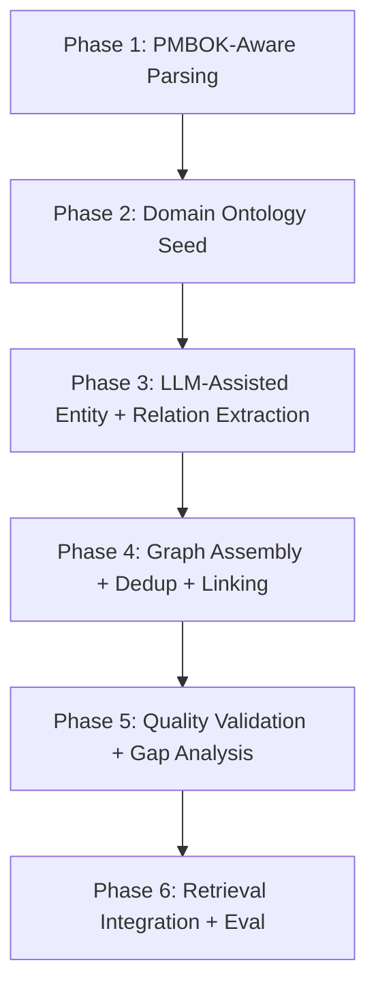
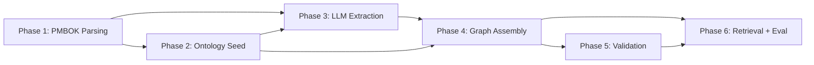

# PMBOK 8th Edition → Comprehensive Knowledge Graph Strategy

> Transform `data/raw/pdfs/pmbokguide_eighthed_eng.pdf` into a richly typed, fully connected knowledge graph where every concept, process, and relationship in the PMBOK is discoverable and linked.

---

## Problem Statement

The current KG pipeline has critical gaps that produce a **sparse, noisy, untyped graph** from the PMBOK:

| Gap | Current State | Impact |
|-----|--------------|--------|
| **Entity extraction** | Regex grabs 2–3 tokens around 8 cue words | Misses 90%+ of PMBOK concepts |
| **Relation vocabulary** | 8 cues + `related_to` fallback | Cannot express ITTO flows, hierarchy, or domain relationships |
| **Node typing** | Everything is `concept` | No distinction between Process, Artifact, Role, Principle, etc. |
| **Section detection** | First non-empty line of page | Loses PMBOK Part/Chapter/Section hierarchy |
| **Canonicalization** | Lowercase + hash | No abbreviation handling, e.g. WBS ≠ Work Breakdown Structure |
| **Cross-references** | None | Sections that reference each other are not linked |
| **Tables and ITTOs** | Not parsed | Input/Tools/Techniques/Output matrices ignored |

---

## PMBOK 8th Edition Structure Overview

The 8th edition restructured around **12 Principles** and **8 Performance Domains** instead of the older 49-process / 10-knowledge-area model. Key structural elements:

- **Part 1** – Standard for Project Management: 12 Principles
- **Part 2** – A Guide to the PMBOK: 8 Performance Domains
- **Appendices** – Tools & Techniques, Artifacts, Models/Methods/Artifacts tables
- **Cross-cutting references** between Principles ↔ Performance Domains ↔ Tools ↔ Artifacts

---

## Strategy: 6-Phase Build



---

## Phase 1 — PMBOK-Aware PDF Parsing & Section Hierarchy

**Goal:** Replace generic page-level section detection with a PMBOK-structure-aware parser that preserves the document hierarchy.

### Tasks

1. **Build a PMBOK TOC parser** that reads the table of contents pages and extracts the hierarchy:
   - Part → Chapter → Section → Subsection
   - Map page ranges to each structural element
   - Output: `pmbok_toc.json` with nested hierarchy and page ranges

2. **Enhance [`sectionize.py`](src/autokg_rag/ingest/sectionize.py:10)** to use the TOC map:
   - Given a page number, look up its position in the hierarchy
   - Return structured section path, e.g. `Part 2 > Stakeholder Performance Domain > 2.3 Engaging Stakeholders`
   - Fallback to current heuristic for pages not in the TOC map

3. **Parse tables and ITTO matrices** from the PDF:
   - Use `pdfplumber` or similar to detect table regions on each page
   - Extract structured table data as rows/columns
   - Tag table chunks with `chunk_type: table` vs `chunk_type: prose`
   - Preserve table context: section heading, caption, column headers

4. **Parse figure references** and cross-reference callouts:
   - Detect patterns like `See Section X.Y`, `Figure X-Y`, `Table X-Y`
   - Store as metadata on each chunk for later edge creation

### Artifacts
- `data/artifacts/{run_id}/pmbok_toc.json` — hierarchical TOC with page ranges
- `data/artifacts/{run_id}/tables.jsonl` — extracted table data
- Enhanced `chunks.parquet` with `chunk_type`, `section_path`, `cross_refs` columns

### Changes to Existing Code
- [`sectionize.py`](src/autokg_rag/ingest/sectionize.py:1) — Add TOC-aware section resolution
- [`pipeline.py`](src/autokg_rag/ingest/pipeline.py:137) — Invoke table extraction, store new metadata
- [`records.py`](src/autokg_rag/schemas/records.py:47) — Extend `ChunkRecord` with optional `chunk_type`, `section_path`, `cross_refs`

---

## Phase 2 — Domain Ontology Seed

**Goal:** Define a typed PMBOK ontology schema so extracted entities get proper types and relationships follow known patterns.

### Tasks

1. **Define PMBOK node types** enum / config:
   - `principle` — The 12 principles
   - `performance_domain` — The 8 performance domains
   - `process` — Legacy processes still referenced
   - `artifact` — Deliverables, documents, plans
   - `tool_technique` — Methods and tools
   - `role` — Project manager, sponsor, stakeholder, team member
   - `concept` — General PM concepts
   - `model_method` — Models and methods from appendices

2. **Create a seed ontology file** `configs/ontology/pmbok_8ed_seed.yaml`:
   - Curated list of ~100–150 key entities with canonical names, aliases, and types
   - 12 principles with their official names
   - 8 performance domains
   - Key artifacts and tools from appendices
   - Common abbreviations, e.g. `WBS: Work Breakdown Structure`, `OPA: Organizational Process Assets`

3. **Define typed relation vocabulary**:
   - `is_part_of` — hierarchy: subsection is part of section
   - `supports` — principle supports performance domain
   - `produces` — process/activity produces artifact
   - `uses` — activity uses tool/technique
   - `input_to` — artifact is input to process
   - `output_of` — artifact is output of process
   - `influences` — concept influences another
   - `mitigates` — strategy mitigates risk
   - `involves_role` — activity involves role
   - `references` — cross-section reference
   - `related_to` — general fallback

4. **Build ontology loader** that merges seed + extracted entities:
   - Seed entities get high confidence and are pre-loaded into the graph
   - Extracted entities get matched against seeds before creating new nodes

### Artifacts
- `configs/ontology/pmbok_8ed_seed.yaml` — curated seed ontology
- New `node_type` enum in [`records.py`](src/autokg_rag/schemas/records.py:65)
- New `relation_type` enum

### Changes to Existing Code
- [`records.py`](src/autokg_rag/schemas/records.py:65) — `KGNodeRecord.node_type` becomes typed enum
- [`records.py`](src/autokg_rag/schemas/records.py:77) — `KGEdgeRecord.relation` becomes typed enum
- New file: `src/autokg_rag/kg/ontology_seed.py` — loader for seed YAML

---

## Phase 3 — LLM-Assisted Entity & Relation Extraction

**Goal:** Replace the regex heuristic extractor with an LLM-powered pipeline that produces high-quality typed entities and relations.

### Tasks

1. **Build a structured extraction prompt** that takes a chunk + its section context and returns:
   - Entities: `name, type, aliases`
   - Relations: `source_entity, relation_type, target_entity, confidence`
   - Use JSON-mode output for reliable parsing

2. **Implement LLM extraction adapter** in `src/autokg_rag/kg/llm_extract.py`:
   - Accepts a chunk + section_path + nearby_chunks for context
   - Calls Ollama local LLM with the structured prompt
   - Parses JSON response into typed entity/relation records
   - Includes retry logic and fallback to heuristic extractor on parse failure

3. **Batch processing with rate control**:
   - Process chunks in batches of 5–10
   - Cache extraction results to `data/artifacts/{run_id}/extraction_cache.jsonl`
   - Support resume-from-checkpoint for long runs over the ~370-page PMBOK

4. **Merge extracted entities with seed ontology**:
   - Fuzzy match extracted entity names against seed entries
   - If match found: use seed canonical name and type, merge aliases
   - If no match: create new node with LLM-assigned type
   - Log unmatched entities for manual review

5. **Keep heuristic extractor as fallback**:
   - Expand [`ontology_extract.py`](src/autokg_rag/kg/ontology_extract.py:14) relation cues to include the new typed vocabulary
   - Use heuristic results as baseline; LLM results override when available

### Artifacts
- `src/autokg_rag/kg/llm_extract.py` — LLM extraction adapter
- `src/autokg_rag/kg/extraction_prompt.py` — Prompt templates
- `data/artifacts/{run_id}/extraction_cache.jsonl` — cached extraction results

### Changes to Existing Code
- [`ontology_extract.py`](src/autokg_rag/kg/ontology_extract.py:147) — Expanded cues; called as fallback
- [`pipeline.py`](src/autokg_rag/kg/pipeline.py:17) — Route to LLM extractor or fallback

---

## Phase 4 — Graph Assembly, Dedup & Cross-Linking

**Goal:** Assemble a clean, fully connected graph from all extraction outputs with deduplication and cross-reference linking.

### Tasks

1. **Enhanced canonicalization** in [`canonicalize.py`](src/autokg_rag/kg/canonicalize.py:12):
   - Abbreviation expansion using seed aliases
   - Acronym detection + resolution, e.g. `EVM` → `Earned Value Management`
   - Fuzzy string matching for near-duplicates, e.g. `risk management plan` vs `risk mgmt plan`
   - Use Levenshtein or token-set ratio with configurable threshold

2. **Cross-reference edge creation**:
   - Use cross-ref metadata from Phase 1 to create `references` edges between sections
   - Create `is_part_of` edges from TOC hierarchy
   - Link principles to performance domains they support per the PMBOK mapping tables

3. **Graph deduplication pass**:
   - Merge nodes with same canonical name but different IDs
   - Consolidate evidence_chunk_ids across merged edges
   - Recalculate edge weights post-merge

4. **Confidence scoring**:
   - Seed entities: confidence 0.95
   - LLM-extracted, matches seed: confidence 0.85
   - LLM-extracted, novel: confidence 0.70
   - Heuristic-extracted: confidence 0.55
   - Edges: weight = sum of extraction occurrences × confidence

5. **Graph connectivity analysis**:
   - Identify disconnected subgraphs
   - Flag orphan nodes with no edges
   - Generate connectivity report

### Artifacts
- Enhanced `kg.sqlite` with typed nodes, typed relations, and cross-ref edges
- `data/artifacts/{run_id}/graph_diagnostics.json` — connectivity stats, orphan list
- `data/artifacts/{run_id}/dedup_log.jsonl` — merge decisions

### Changes to Existing Code
- [`canonicalize.py`](src/autokg_rag/kg/canonicalize.py:1) — Add alias expansion, fuzzy matching
- [`store_sqlite.py`](src/autokg_rag/kg/store_sqlite.py:12) — Add indexes for typed queries
- [`pipeline.py`](src/autokg_rag/kg/pipeline.py:17) — Add dedup + cross-linking stages

---

## Phase 5 — Quality Validation & Gap Analysis

**Goal:** Verify the graph covers the PMBOK comprehensively and identify gaps.

### Tasks

1. **Coverage checklist validation**:
   - All 12 principles have nodes
   - All 8 performance domains have nodes
   - Each performance domain links to at least 3 principles
   - Key artifacts from appendices are present
   - Common tools/techniques are present

2. **Graph statistics dashboard**:
   - Total nodes by type
   - Total edges by relation type
   - Average node degree
   - Largest connected component size vs total
   - Distribution of evidence_chunk_ids per edge

3. **Manual spot-check sampling**:
   - Generate 20 random subgraph views for human review
   - Output as markdown with node → relation → node triples
   - Include source chunk text for verification

4. **Gap detection**:
   - Compare graph entities against PMBOK index terms
   - Flag known PMBOK terms missing from the graph
   - Generate suggested additions

5. **Eval dataset for graph quality**:
   - Create 30–50 PMBOK-specific questions that require graph traversal
   - Include multi-hop questions, e.g. `What tools does the Stakeholder Performance Domain recommend?`
   - Store in `eval/datasets/pmbok_graph_questions.jsonl`

### Artifacts
- `reports/pmbok_graph_coverage.md` — coverage report
- `reports/pmbok_graph_stats.json` — statistics
- `eval/datasets/pmbok_graph_questions.jsonl` — graph-specific eval set

---

## Phase 6 — Retrieval Integration & Evaluation

**Goal:** Wire the improved graph into the hybrid retrieval pipeline and measure improvement.

### Tasks

1. **Typed graph retrieval** — Enhance [`retriever.py`](src/autokg_rag/kg/retriever.py:49):
   - Entity-type-aware seed node selection: match question intent to node types
   - Weighted traversal that prioritizes typed relations over `related_to`
   - Path explanation: return the traversal path for citation transparency

2. **Hybrid fusion tuning**:
   - Test different vector:graph score ratios on the PMBOK eval set
   - Add graph-type-bonus: boost hits from structurally relevant nodes

3. **Run evaluation matrix**:
   - Compare: vector-only vs. old-graph-hybrid vs. new-graph-hybrid
   - Metrics: Recall@5, Recall@10, nDCG@10, citation precision
   - Use both general PMBOK questions and graph-specific multi-hop questions

4. **Streamlit graph explorer** — optional UI enhancement:
   - Visualize subgraph around a query
   - Show node types, relation types, and evidence chunks
   - Allow drilling into source text

### Artifacts
- Enhanced [`retriever.py`](src/autokg_rag/kg/retriever.py:1) with typed traversal
- `reports/experiments/pmbok_graph_eval.csv` — comparison results
- Optional: graph visualizer component in `app/components/`

---

## Implementation Order & Dependencies



**Critical path:** Phase 1 → Phase 3 → Phase 4 → Phase 6

Phases 2 and 5 can be partially parallelized with their successors.

---

## Schema Additions Summary

### Extended `ChunkRecord`

```python
class ChunkRecord:
    # existing fields...
    chunk_type: str = "prose"        # prose | table | figure_caption
    section_path: str = ""           # Part 2 > Stakeholder > 2.3
    cross_refs: list[str] = []       # Section X.Y, Figure X-Y references
```

### Node Type Enum

```python
NodeType = Literal[
    "principle",
    "performance_domain",
    "process",
    "artifact",
    "tool_technique",
    "role",
    "model_method",
    "concept",
]
```

### Relation Type Enum

```python
RelationType = Literal[
    "is_part_of",
    "supports",
    "produces",
    "uses",
    "input_to",
    "output_of",
    "influences",
    "mitigates",
    "involves_role",
    "references",
    "related_to",
]
```

---

## Risk / Open Questions

| Risk | Mitigation |
|------|-----------|
| LLM extraction quality varies across chunk types | Fall back to heuristic; cache results for review |
| Ollama throughput on 370+ pages is slow | Batch processing with checkpoint resume |
| PMBOK 8th edition structure differs from expected | TOC parser validates against known structure; manual adjustment if needed |
| Over-extraction creates noisy graph | Confidence thresholds + dedup pass; prune low-confidence edges |
| Seed ontology incomplete | Start with ~100–150 entities; expand based on gap analysis in Phase 5 |

---

## Success Criteria

- [ ] Graph contains all 12 principles and 8 performance domains as typed nodes
- [ ] At least 500 total nodes with typed categories
- [ ] At least 1,000 edges with typed relations
- [ ] Largest connected component covers >90% of nodes
- [ ] Hybrid retrieval with new graph beats vector-only by >10% on Recall@10
- [ ] Multi-hop PMBOK questions show >20% improvement over old graph
- [ ] Every edge has at least one evidence_chunk_id linking back to source text
