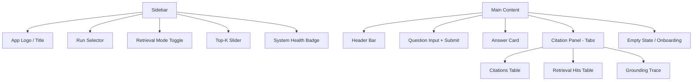
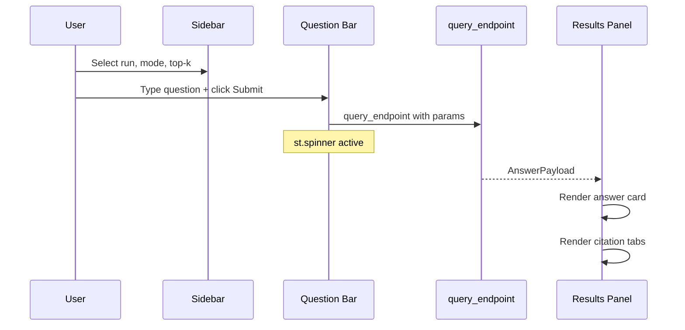

# Streamlit Frontend Redesign — Professional & Minimalist

**Date:** 2026-02-14  
**Status:** Draft  
**Goal:** Replace the current M6 demo Streamlit app with a polished, professional, minimalist frontend that surfaces all AutoRAG capabilities.

---

## 1. Current State

The existing app ([`app/streamlit_app.py`](app/streamlit_app.py)) is a single-page demo with:
- A flat list of controls (run selector, mode radio, question input, top-k slider)
- Raw dataframe dumps for citations and hits
- Raw JSON dump for the citation trace
- Minimal CSS in [`app/styles.css`](app/styles.css) — just background gradients and accent colors
- No sidebar, no conversation history, no loading states, no error UX

---

## 2. Design Principles

| Principle | Description |
|---|---|
| **Minimalist** | Generous whitespace, no clutter, muted neutral palette with a single accent color |
| **Professional** | Clean typography, consistent spacing, polished empty states |
| **Functional** | Every element earns its place — no decorative-only chrome |
| **Accessible** | Sufficient contrast ratios, keyboard navigable, readable font sizes |

---

## 3. Color Palette & Typography

```
--bg:        #FAFAF8    (warm off-white)
--surface:   #FFFFFF    (cards/panels)
--border:    #E8E8E4    (subtle dividers)
--ink:       #1A1A1A    (primary text)
--muted:     #6B7280    (secondary text)
--accent:    #0A5C5C    (teal — keep existing brand)
--accent-bg: #F0F7F7    (light teal wash for highlights)
--error:     #DC2626    (red for errors)
--success:   #059669    (green for grounding scores)
```

Typography: System font stack — `-apple-system, BlinkMacSystemFont, Segoe UI, Roboto, sans-serif`. Headings at 600 weight, body at 400.

---

## 4. Layout Architecture



### Sidebar
- App name and version at the top
- Run ID dropdown with the count of available runs
- Retrieval mode as a segmented control — vector / graph / hybrid
- Top-K slider with current value label
- Small health indicator showing whether artifacts exist

### Main Area
- Clean header with breadcrumb-style context: `Run: <id> · Mode: hybrid · Top-K: 8`
- Full-width question input with a prominent submit button
- **Answer Card**: White card with the answer text, citation count badge, grounding sentence count
- **Citation Panel**: Tabbed interface replacing the current stacked raw dumps
  - **Tab 1 — Citations**: Styled table with chunk ID, doc, page, section columns
  - **Tab 2 — Retrieval Hits**: Sortable table with rank, scores, chunk/section
  - **Tab 3 — Grounding Trace**: Expandable rows showing sentence → citation → support score

---

## 5. File Structure

```
app/
├── __init__.py              # unchanged
├── streamlit_app.py         # rewritten — layout orchestrator
├── components/
│   ├── __init__.py          # re-export all component render functions
│   ├── sidebar.py           # sidebar controls + health badge
│   ├── question_bar.py      # question input + submit button
│   ├── answer_card.py       # answer text + citation summary metrics
│   ├── citation_tabs.py     # tabbed citation / hits / trace panels
│   └── empty_state.py       # onboarding and no-data states
├── styles/
│   ├── main.css             # primary stylesheet
│   └── components.css       # component-scoped overrides
└── assets/
    └── logo.svg             # optional small logo mark
```

Old [`app/components.py`](app/components.py) will be replaced by the `components/` package.  
Old [`app/styles.css`](app/styles.css) will be replaced by `styles/main.css`.

---

## 6. Component Specifications

### 6.1 Sidebar (`sidebar.py`)

- `render_sidebar(st) -> SidebarState` returning a dataclass with `run_id`, `mode`, `top_k`
- Uses `st.sidebar` context
- Displays app title with `st.sidebar.markdown` styled heading
- Run selector: `st.sidebar.selectbox` with latest run pre-selected
- Mode: `st.sidebar.radio` with `horizontal=True`
- Top-K: `st.sidebar.slider` with min=1, max=20, default=8
- Health badge: green dot if runs exist, amber warning if none

### 6.2 Question Bar (`question_bar.py`)

- Full-width `st.text_input` with placeholder text
- `st.button` styled with accent color via CSS
- Returns `(question: str, submitted: bool)`

### 6.3 Answer Card (`answer_card.py`)

- White card rendered via `st.container` with custom CSS border/shadow
- Answer text in a `st.markdown` block
- Row of metric pills: citation count, grounded sentences count
- Uses `st.metric` or custom HTML for the pills

### 6.4 Citation Tabs (`citation_tabs.py`)

- Uses `st.tabs` with three tabs
- **Citations**: `st.dataframe` with styled columns, `use_container_width=True`
- **Hits**: `st.dataframe` with score columns formatted to 4 decimal places
- **Trace**: `st.expander` per sentence showing citation details and support score with a colored bar

### 6.5 Empty State (`empty_state.py`)

- Centered illustration-free message with clear CTA
- Two variants:
  1. No runs available → instructions to run `make demo-build`
  2. No query submitted → prompt to ask a question

---

## 7. CSS Strategy

All custom CSS injected via `st.markdown(unsafe_allow_html=True)` at app startup.

Key overrides:
- Remove default Streamlit padding excess
- Card shadows: `box-shadow: 0 1px 3px rgba(0,0,0,0.08)`
- Border radius: `12px` on containers
- Button styling: solid accent background, white text, no border
- Dataframe header: accent background, white text
- Tab underline: accent color
- Sidebar: subtle warm gradient background

---

## 8. Session State & UX Polish

- Store last query result in `st.session_state` so page rerenders do not lose the answer
- Show a `st.spinner` during query execution
- Display timing info: `Answered in X.XXs`
- Error messages in a styled error card, not raw `st.error`

---

## 9. Interaction Flow



---

## 10. Implementation Checklist

> Each item is a single, atomic task suitable for one code-mode pass.

- [ ] Create `app/components/` package with `__init__.py`
- [ ] Create `app/styles/main.css` with full minimalist stylesheet
- [ ] Create `app/styles/components.css` with component-scoped styles
- [ ] Implement `app/components/sidebar.py` — sidebar controls returning `SidebarState` dataclass
- [ ] Implement `app/components/empty_state.py` — no-runs and no-query empty states
- [ ] Implement `app/components/question_bar.py` — input and submit button
- [ ] Implement `app/components/answer_card.py` — styled answer display with metric pills
- [ ] Implement `app/components/citation_tabs.py` — tabbed citations, hits, and grounding trace
- [ ] Rewrite `app/streamlit_app.py` — orchestrate new components, session state, spinner, timing
- [ ] Add session state persistence so results survive rerender
- [ ] Delete old `app/components.py` and `app/styles.css` after migration
- [ ] Update `tests/app/test_streamlit_smoke.py` to cover new component structure
- [ ] Manual visual QA pass — launch app, verify layout, test all tabs, test empty states
- [ ] Commit each file-level change with descriptive message referencing this plan

---

## 11. Dependencies

No new dependencies required. The app uses only:
- `streamlit>=1.42.0` (already in [`pyproject.toml`](pyproject.toml))
- Existing `autokg_rag.app_api.endpoints` and `autokg_rag.schemas.api`

---

## 12. Out of Scope

- FastAPI / REST layer (future work)
- Authentication / multi-user
- Dark mode toggle (can be added later via CSS variables)
- File upload for new documents (separate feature)
- Chat-style multi-turn conversation
