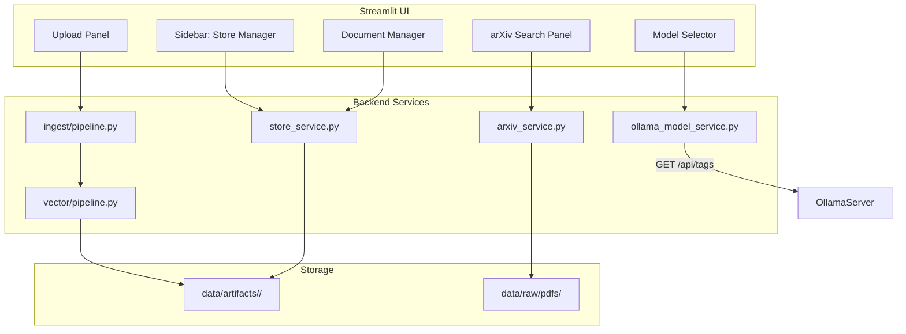

# Vector Store Management, Ollama Model Selection & arXiv Integration

**Date:** 2026-02-14
**Status:** Draft
**Scope:** Streamlit UI enhancements for vector store CRUD, dynamic Ollama model selection, and arXiv document ingestion

---

## Overview

This plan adds five major capabilities to the AutoRAG Streamlit application:

1. **Add/Remove Vector Stores** — Create and delete named vector stores from the UI
2. **Multi-Document Upload** — Upload multiple documents into a single store at once
3. **Per-Document Management** — Add or remove individual documents from an existing store
4. **Dynamic Ollama Model Selection** — Query the local Ollama instance for available models and let the user pick one
5. **arXiv Search & Ingest** — Search arxiv.org by topic, select papers, download PDFs, and vectorize them into a store

---

## Architecture



---

## Feature 1: Add & Remove Vector Stores

### Current State
- Stores are identified by `run_id` directories under [`data/artifacts/`](data/artifacts/)
- [`list_available_runs()`](src/autokg_rag/app_api/service.py:33) scans for directories containing `chunks.parquet`
- No create/delete UI — stores are created via CLI pipelines only

### Plan

#### Backend: `src/autokg_rag/app_api/store_service.py`
- `create_store(store_name: str, settings: Settings) -> str` — create empty artifact directory with metadata
- `delete_store(store_name: str, settings: Settings) -> bool` — remove artifact directory and all contents
- `list_stores(settings: Settings) -> list[StoreInfo]` — return store name, doc count, chunk count, created date
- `get_store_info(store_name: str, settings: Settings) -> StoreInfo` — detailed info for one store

#### Frontend: `app/components/store_manager.py`
- New sidebar section with:
  - Dropdown of existing stores
  - "Create Store" button with text input for name
  - "Delete Store" button with confirmation dialog
  - Display store stats: document count, chunk count, embedding status

#### Data Model: `StoreInfo` schema in `src/autokg_rag/schemas/api.py`
```python
class StoreInfo:
    store_name: str
    doc_count: int
    chunk_count: int
    has_embeddings: bool
    created_at: str
```

---

## Feature 2: Upload Multiple Documents into One Store

### Current State
- [`run_ingest_pipeline()`](src/autokg_rag/ingest/pipeline.py:137) takes an `input_dir` and ingests all PDFs found
- No Streamlit file upload capability exists

### Plan

#### Backend: `src/autokg_rag/app_api/upload_service.py`
- `upload_documents(store_name: str, files: list[UploadedFile], settings: Settings) -> IngestResult`
  - Save uploaded files to a temp directory
  - Call existing [`run_ingest_pipeline()`](src/autokg_rag/ingest/pipeline.py:137) with that temp dir
  - Call [`run_index_vector_pipeline()`](src/autokg_rag/vector/pipeline.py:24) to build embeddings
  - Return counts: documents, pages, chunks

#### Frontend: `app/components/upload_panel.py`
- Streamlit `st.file_uploader` with `accept_multiple_files=True`, filtered to `.pdf`
- Store selector dropdown to pick target store
- Upload button that triggers ingest + vectorization
- Progress bar using `st.progress` during ingest
- Success/error toast with document count summary

---

## Feature 3: Add or Remove Specific Documents from a Store

### Current State
- [`DocumentRecord`](src/autokg_rag/schemas/records.py) tracks `doc_id`, `title`, `source_path`, `sha256`
- Documents are stored in `documents.parquet` per run
- No per-document deletion or incremental addition

### Plan

#### Backend: `src/autokg_rag/app_api/document_service.py`
- `list_documents(store_name: str, settings: Settings) -> list[DocumentInfo]` — read `documents.parquet`
- `remove_document(store_name: str, doc_id: str, settings: Settings) -> bool`
  - Filter out chunks, pages, and embedding rows for the given `doc_id`
  - Rewrite `chunks.parquet`, `pages.parquet`, `documents.parquet`
  - Rebuild `embeddings.npy` and `embedding_meta.parquet` without removed chunks
- `add_documents(store_name: str, files: list[UploadedFile], settings: Settings) -> IngestResult`
  - Incremental ingest: parse new PDFs, chunk them, append to existing parquet files
  - Rebuild embedding artifacts to include new chunks

#### Frontend: `app/components/document_manager.py`
- Table/list view of documents in the selected store
  - Columns: title, doc_id, page count, chunk count
- Per-row delete button with confirmation
- "Add Documents" file uploader for incremental addition
- Refresh button to reload document list

#### Incremental Re-embedding Strategy
- On document removal: filter numpy array rows by chunk_id, save truncated array
- On document addition: compute embeddings for new chunks only, `np.concatenate` with existing matrix
- Update `embedding_meta.parquet` to maintain row alignment

---

## Feature 4: Choose Ollama Models Based on System Availability

### Current State
- [`OllamaClient.list_tags()`](src/autokg_rag/ollama/client.py:108) already queries `/api/tags`
- Model names are hardcoded in [`Settings`](src/autokg_rag/config/settings.py:26): `reranker_model`, `answer_model`, `embedding_model`
- No UI for model selection

### Plan

#### Backend: `src/autokg_rag/app_api/ollama_model_service.py`
- `list_available_models(settings: Settings) -> list[OllamaModelInfo]`
  - Call [`OllamaClient.list_tags()`](src/autokg_rag/ollama/client.py:108)
  - Parse response into structured model info: name, size, quantization, family
  - Categorize models: chat/generation vs embedding
- `check_ollama_health(settings: Settings) -> bool` — verify Ollama is reachable

#### Frontend: `app/components/model_selector.py`
- Sidebar section "Model Configuration"
- Dropdown for "Answer Model" — populated from Ollama available models
- Dropdown for "Embedding Model" — filtered to embedding-capable models
- Dropdown for "Reranker Model" — filtered to chat-capable models
- Connection status indicator: green dot if Ollama is reachable, red if not
- Refresh button to re-query available models
- Selected models stored in `st.session_state` and passed to query handler

#### Schema: `OllamaModelInfo` in `src/autokg_rag/schemas/api.py`
```python
class OllamaModelInfo:
    name: str
    size_bytes: int
    family: str
    parameter_size: str
    quantization_level: str
```

---

## Feature 5: arXiv Search & Ingest

### Current State
- No arXiv integration exists
- Ingest pipeline handles local PDF files only

### Plan

#### New Dependency
- Add `arxiv>=2.1.0` to `pyproject.toml` dependencies for the arxiv API client

#### Backend: `src/autokg_rag/arxiv/client.py`
- `search_arxiv(query: str, max_results: int = 10) -> list[ArxivPaper]`
  - Use `arxiv` Python package to search
  - Return structured results: title, authors, abstract, arxiv_id, pdf_url, published date
- `download_papers(papers: list[ArxivPaper], output_dir: Path) -> list[Path]`
  - Download selected PDFs to `data/raw/pdfs/arxiv/`
  - Return list of downloaded file paths

#### Backend: `src/autokg_rag/arxiv/ingest.py`
- `ingest_arxiv_papers(store_name: str, papers: list[ArxivPaper], settings: Settings) -> IngestResult`
  - Download PDFs
  - Run ingest pipeline on downloaded files
  - Run vector indexing pipeline
  - Return document/chunk counts

#### Frontend: `app/components/arxiv_panel.py`
- Search input field for topic/query
- "Search" button that queries arXiv API
- Results table with columns: title, authors, published date, abstract preview
- Checkboxes for paper selection
- Target store dropdown
- "Import Selected" button that downloads and ingests selected papers
- Progress indicator during download and vectorization

#### Schema: `ArxivPaper` in `src/autokg_rag/schemas/api.py`
```python
class ArxivPaper:
    arxiv_id: str
    title: str
    authors: list[str]
    abstract: str
    pdf_url: str
    published: str
```

---

## Implementation Order

### Phase 1: Backend Foundation
1. Create `StoreInfo`, `OllamaModelInfo`, `ArxivPaper` schemas in [`schemas/api.py`](src/autokg_rag/schemas/api.py)
2. Implement `store_service.py` — create, delete, list, info
3. Implement `ollama_model_service.py` — list models, health check
4. Implement `document_service.py` — list, remove, add documents with incremental re-embedding
5. Implement `upload_service.py` — file upload to temp dir, trigger ingest + index
6. Implement `arxiv/client.py` — search and download
7. Implement `arxiv/ingest.py` — end-to-end arXiv-to-vectorstore pipeline

### Phase 2: Streamlit UI Components
8. Build `store_manager.py` — store CRUD sidebar component
9. Build `model_selector.py` — dynamic Ollama model dropdowns
10. Build `upload_panel.py` — multi-file upload UI
11. Build `document_manager.py` — per-document list and delete UI
12. Build `arxiv_panel.py` — search, select, import UI

### Phase 3: Integration & Wiring
13. Wire new components into [`streamlit_app.py`](app/streamlit_app.py) main layout
14. Update [`sidebar.py`](app/components/sidebar.py) to include store selection and model selection
15. Add new endpoints in [`endpoints.py`](src/autokg_rag/app_api/endpoints.py)
16. Update [`Settings`](src/autokg_rag/config/settings.py) if new config fields are needed

### Phase 4: Testing
17. Unit tests for `store_service.py`
18. Unit tests for `document_service.py` — especially incremental re-embedding
19. Unit tests for `ollama_model_service.py` with mocked HTTP
20. Unit tests for `arxiv/client.py` with mocked API
21. Integration test for upload-to-query flow
22. Streamlit smoke tests for new components

### Phase 5: Polish
23. Add CSS styles for new components in [`app/styles/components.css`](app/styles/components.css)
24. Error handling and user feedback for all operations
25. Update [`README.md`](README.md) with new feature documentation

---

## New Files Summary

| File | Purpose |
|------|---------|
| `src/autokg_rag/app_api/store_service.py` | Store CRUD operations |
| `src/autokg_rag/app_api/document_service.py` | Per-document management |
| `src/autokg_rag/app_api/upload_service.py` | File upload handling |
| `src/autokg_rag/app_api/ollama_model_service.py` | Ollama model discovery |
| `src/autokg_rag/arxiv/__init__.py` | arXiv package init |
| `src/autokg_rag/arxiv/client.py` | arXiv API search/download |
| `src/autokg_rag/arxiv/ingest.py` | arXiv-to-vectorstore pipeline |
| `app/components/store_manager.py` | Store management UI |
| `app/components/model_selector.py` | Ollama model selector UI |
| `app/components/upload_panel.py` | Multi-file upload UI |
| `app/components/document_manager.py` | Document list/delete UI |
| `app/components/arxiv_panel.py` | arXiv search & import UI |

## Modified Files Summary

| File | Changes |
|------|---------|
| [`pyproject.toml`](pyproject.toml) | Add `arxiv>=2.1.0` dependency |
| [`src/autokg_rag/schemas/api.py`](src/autokg_rag/schemas/api.py) | Add `StoreInfo`, `OllamaModelInfo`, `ArxivPaper` models |
| [`app/streamlit_app.py`](app/streamlit_app.py) | Wire new components into main layout |
| [`app/components/sidebar.py`](app/components/sidebar.py) | Add store selector, model selector sections |
| [`app/components/__init__.py`](app/components/__init__.py) | Export new component render functions |
| [`src/autokg_rag/app_api/endpoints.py`](src/autokg_rag/app_api/endpoints.py) | Add endpoints for store, document, model, arxiv operations |
| [`app/styles/components.css`](app/styles/components.css) | Styles for new UI components |

---

## Key Design Decisions

1. **Incremental re-embedding over full rebuild**: When adding/removing documents, only the affected embedding rows are modified. This avoids expensive full re-embedding for large stores.

2. **Reuse existing pipelines**: [`run_ingest_pipeline()`](src/autokg_rag/ingest/pipeline.py:137) and [`run_index_vector_pipeline()`](src/autokg_rag/vector/pipeline.py:24) are reused rather than duplicated. New services orchestrate these existing functions.

3. **Store = run_id**: Stores map 1:1 to `run_id` artifact directories. No new storage abstraction is introduced — this keeps compatibility with the existing CLI workflows.

4. **Ollama model categorization**: Models are categorized heuristically based on name patterns — embedding models typically contain "embed" in the name, while chat models do not. Fallback allows any model to be used in any role.

5. **arXiv as a separate package**: The `src/autokg_rag/arxiv/` module is self-contained so it can be easily disabled or replaced with other paper sources later.

6. **Session state for model selection**: Selected Ollama models are stored in `st.session_state` and merged into `Settings` at query time, avoiding the need to persist model choices to disk.
