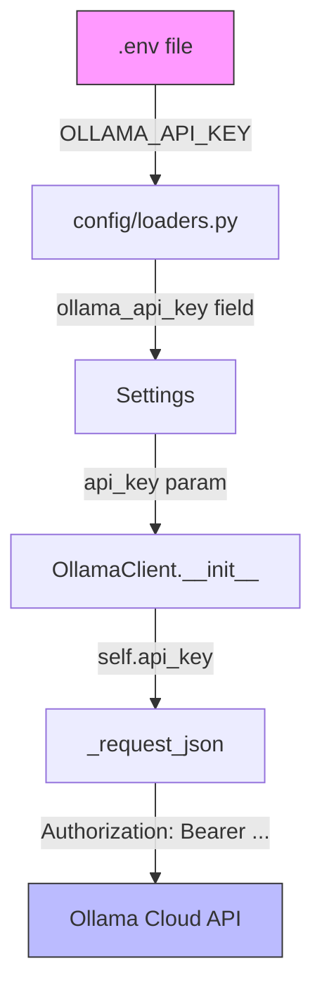

# Plan: Ollama Cloud API Key Support

## Goal

Enable AutoRAG to use Ollama Cloud (remote) models by reading `OLLAMA_API_KEY` from the `.env` file and injecting it as a `Bearer` token in all HTTP requests to the Ollama API.

---

## Current State

- [`OllamaClient`](src/autokg_rag/ollama/client.py:13) is a stdlib `urllib`-based HTTP client that talks to Ollama at a configurable `base_url`.
- The client is instantiated in **8 call sites** across the codebase — always with `base_url` and `timeout_seconds`, never with an API key.
- [`Settings`](src/autokg_rag/config/settings.py:9) holds `ollama_base_url` and `ollama_timeout_seconds` but has no `ollama_api_key` field.
- [`_load_env_overrides()`](src/autokg_rag/config/loaders.py:41) maps `AUTORAG_*` env vars to settings fields but does not handle any API key.
- [`.env.example`](.env.example:1) documents the available env vars — no key entry exists yet.
- No `Authorization` header is ever set on outgoing requests.

---

## Design Decisions

1. **Env var name**: Use `OLLAMA_API_KEY` as requested. Map it to settings field `ollama_api_key`.
2. **Header injection**: Add `Authorization: Bearer <key>` to every request when the key is non-empty. This matches the Ollama Cloud authentication scheme.
3. **Optional by default**: The key is `None`/empty by default so local Ollama usage is unaffected.
4. **Single injection point**: The `Authorization` header is added inside [`OllamaClient._request_json()`](src/autokg_rag/ollama/client.py:34), so all call sites get it automatically without changes.

---

## Implementation Steps

### 1. Add `ollama_api_key` to Settings
**File**: [`src/autokg_rag/config/settings.py`](src/autokg_rag/config/settings.py:9)

- Add field: `ollama_api_key: str = Field(default="", description="Bearer token for Ollama Cloud")`
- Keep it as a plain string with empty default so local usage is zero-config.

### 2. Wire up env var in config loader
**File**: [`src/autokg_rag/config/loaders.py`](src/autokg_rag/config/loaders.py:41)

- Add entry to `env_map`: `"OLLAMA_API_KEY": ("ollama_api_key", str)`

### 3. Accept `api_key` in `OllamaClient.__init__`
**File**: [`src/autokg_rag/ollama/client.py`](src/autokg_rag/ollama/client.py:16)

- Add optional param `api_key: str = ""` to `__init__`.
- Store as `self.api_key`.

### 4. Inject `Authorization` header in `_request_json`
**File**: [`src/autokg_rag/ollama/client.py`](src/autokg_rag/ollama/client.py:34)

- After building `headers`, if `self.api_key` is truthy, add: `headers["Authorization"] = f"Bearer {self.api_key}"`.

### 5. Pass `api_key` from Settings at all 8 instantiation sites
**Files** (each creates an `OllamaClient`):

| # | File | Line |
|---|------|------|
| 1 | [`src/autokg_rag/answer/ollama_adapter.py`](src/autokg_rag/answer/ollama_adapter.py:24) | `_client()` method |
| 2 | [`src/autokg_rag/embeddings/factory.py`](src/autokg_rag/embeddings/factory.py:53) | `create_embedding_provider()` |
| 3 | [`src/autokg_rag/app_api/service.py`](src/autokg_rag/app_api/service.py:274) | reranker client |
| 4 | [`src/autokg_rag/app_api/ollama_model_service.py`](src/autokg_rag/app_api/ollama_model_service.py:42) | `list_available_models()` |
| 5 | [`src/autokg_rag/eval/judge.py`](src/autokg_rag/eval/judge.py:77) | `evaluate_answer()` |
| 6 | [`src/autokg_rag/eval/judge.py`](src/autokg_rag/eval/judge.py:117) | `evaluate_batch()` |
| 7 | [`src/autokg_rag/ingest/image_caption.py`](src/autokg_rag/ingest/image_caption.py:71) | `caption_image()` |
| 8 | [`src/autokg_rag/ingest/image_caption.py`](src/autokg_rag/ingest/image_caption.py:103) | `caption_images_batch()` |

**Strategy**: Each site already receives a `Settings` object or individual params. Thread `api_key=settings.ollama_api_key` (or the explicit param) to the `OllamaClient(...)` call.

For [`OllamaAdapter`](src/autokg_rag/answer/ollama_adapter.py:14), add an `api_key: str = ""` field to the dataclass and pass it through in `_client()`. Update [`get_ollama_adapter()`](src/autokg_rag/answer/ollama_adapter.py:109) to accept and forward the key.

### 6. Update `.env.example`
**File**: [`.env.example`](.env.example:1)

- Add commented entry: `# OLLAMA_API_KEY=` with a descriptive comment explaining it enables Ollama Cloud authentication.

### 7. Add unit tests

- **Test `OllamaClient` sends `Authorization` header when `api_key` is set** — mock `urllib.request.urlopen` and assert the header is present.
- **Test `OllamaClient` omits `Authorization` header when `api_key` is empty** — assert no auth header.
- **Test `Settings` loads `OLLAMA_API_KEY` from env** — use `monkeypatch.setenv` and verify `settings.ollama_api_key`.
- **Test `OllamaAdapter` forwards `api_key` to client** — verify the constructed client has the key.

### 8. Update documentation
**File**: [`docs/runbook.md`](docs/runbook.md:1) or relevant docs

- Document `OLLAMA_API_KEY` env var usage for Ollama Cloud.
- Note that setting `AUTORAG_OLLAMA_BASE_URL` to the Ollama Cloud endpoint is also required.

---

## Architecture Flow

---

## Risk / Notes

- **No secrets in logs**: Ensure `ollama_api_key` is not logged or written to resolved config artifacts. Consider excluding it from [`write_resolved_config()`](src/autokg_rag/config/loaders.py:92) output.
- **Backward compatible**: Empty key means no header — existing local Ollama setups work unchanged.
- **Base URL must change too**: Users targeting Ollama Cloud need to set `AUTORAG_OLLAMA_BASE_URL` to the cloud endpoint. Document this clearly.
